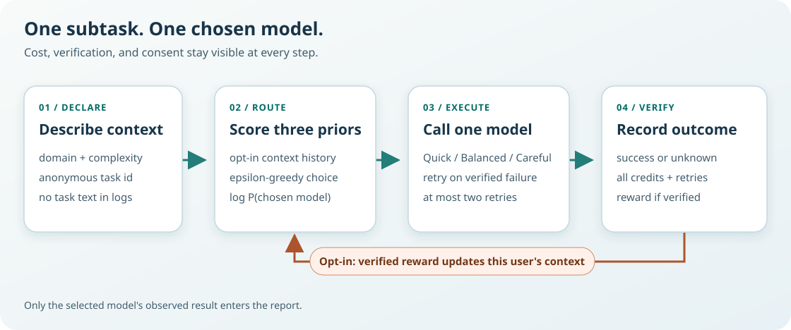

# Design and roadmap

## Decision map

**Text alternative:** Assign each subtask a domain and complexity. Score Quick, Balanced, and Careful from their priors and, only with consent, that user's verified outcomes for the same domain and complexity. Choose one model with epsilon-greedy exploration and record the probability of that choice. Execute only that model; after a verified failure, retry it up to the configured cap. Record the selected model's verified success or unknown, all call credits, retries, and reward if verified. Only verified, opted-in feedback updates personal history. No counterfactual result is recorded.

## Inputs and policy

The caller supplies `Task(id, domain, complexity)`. Domain is one of `code`, `writing`, `reasoning`; complexity is `1` (bounded, directly checkable), `2` (dependent steps or local verification), or `3` (ambiguous or cross-component, with a recovery/verification plan). Descriptions in the fixture illustrate the rubric but are never logged. There is no automatic difficulty classifier.

The [profiles](../src/model_route/data/profiles.json) contain a starting success probability for each model/domain/complexity and synthetic credits per call. The [scenario](../src/model_route/data/scenarios.json) has separate synthetic user-specific probability offsets. Only the simulator sees those offsets; the router sees the priors and outcomes of its own chosen actions.

For model `m` in context `x`, let `p` be its prior per-attempt success probability, `c` its credits per call, and `R` the retry cap (0–2). The prior expected calls are `C = sum((1-p)^i, i=0..R)`. The prior score is `1 - (1-p)^(R+1) - cost_weight*c*C - retry_weight*(C-1)`. Defaults are `cost_weight=0.06` and `retry_weight=0.03`. Actual verified reward is `1[success] - cost_weight*total_credits - retry_weight*retries`. The total includes failed attempts.

For an opted-in user, the router averages that prior score with observed rewards for **that user, domain, complexity, and model**, using `prior_strength=4` pseudo-observations. Other contexts and users stay on their priors. It chooses the highest score (fixture order breaks ties), except that with probability `epsilon=0.15` it samples uniformly from all three models. Thus the logged propensity for the chosen model is `epsilon/3 + (1-epsilon)` if it was greedy, or `epsilon/3` otherwise. This is conditional on the history available at selection time. Retries follow a fixed same-model rule, not a second routing decision.

## Verification, privacy, and comparison

The simulator uses a SHA-256-derived draw keyed by seed, anonymous task id, and attempt. The same task/attempt draw is available to each policy's separate run, but a run computes **only its selected model's result**. Verification is a synthetic success draw, not a real quality judgment. If verification is missing, there is one paid call, no retry, `verified_success=null`, and `reward=null`; the router does not learn from it. The report includes these costs and gives success rate and mean reward only over verified tasks, with `verified_count` alongside the total.

User history lives in memory only after `opt_in(user_id)`. `forget(user_id)` removes history and consent and anonymizes any in-flight choice before its feedback arrives. An unconsented identifier is never retained by the router. The optional JSON report records anonymous task ids and chosen-action fields, with no user id or task text. A real adapter must decide which task metadata may safely be logged and implement durable consent, retention, deletion, and access controls.

The four baselines are always-Quick, always-Careful, uniform random, and a static rule (complexity 1 → Quick, 2 → Balanced, 3 → Careful). Each runs on the same ordered synthetic subtasks. Their chosen-action propensities are 1 for deterministic rules and 1/3 for random. This is a seeded **on-policy simulation**, not an off-policy estimate from production logs; the figures are illustrative and should not be read as measured savings.

## Next steps

1. Define independent, auditable verification per domain and test calibration of priors and retry behavior on consented data.
2. Add retention limits, protected storage, deletion semantics, and a real-provider adapter with measured token/call costs and rollback controls.
3. Compare policies across repeated seeds and representative user cohorts; only then try importance-weighted or doubly robust offline evaluation with support checks, uncertainty intervals, and safeguards against missing or biased judgments.
